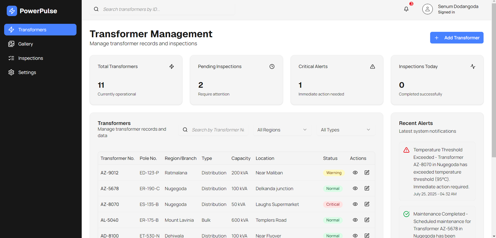

# Transformer Management System

A full-stack application for managing electrical transformers, inspections, and thermal images. The project includes a modern Next.js front end and a Java Spring Boot back end exposing REST endpoints. PostgreSQL (via Supabase) is used as the primary data store, and Cloudinary provides image hosting.

## Contents

- Overview
- Architecture
- Implemented features
- Project structure
- Setup and running locally
- Environment variables
- Database and seeding
- API endpoints
- Known limitations and issues
- Roadmap ideas

## Overview

This application supports day‑to‑day transformer management: create and update transformer records, record inspections, upload and browse thermal images, and review a dashboard with status and alerts. The UI is built with Next.js, Tailwind CSS, and a component system based on Radix UI.

## Architecture

- Front end
  - Next.js 15, React 18, TypeScript
  - Tailwind CSS 4, shadcn/ui + Radix primitives

- Back end
  - Java 17, Spring Boot 3.2.0
  - JPA/Hibernate entities for Transformer, Inspection, Image, User
  - BCrypt hashing for User passwords (server-side)
  - REST controllers under /api

- Database
  - PostgreSQL (Supabase)
  - Tables: transformers, inspections, images, users
  - Seed scripts and an in-app settings panel to preview schema and seed sample data

- Storage
  - Cloudinary for image uploads

## Implemented features

- Authentication
  - Login and Sign Up UI with SHA-256 hashing on the client (Next.js) before storing in Supabase
  - Minimal cookie-based session handling in the app
  - Spring Boot back end provides a separate BCrypt-based auth for its own User table

- Transformers
  - Create, edit, delete, and list transformers
  - Filters by region/type and a global search bar on the dashboard
  - Transformer detail navigation and last inspection metadata

- Inspections
  - List, create, edit, and delete inspections
  - Auto-generate inspection numbers when missing
  - Status tracking (In Progress, Pending, Completed)

- Images
  - Cloudinary-powered image upload (multipart/form-data)
  - Image gallery with filters, search, preview modal, and download
  - Images tagged with type (baseline/maintenance) and environmental conditions (sunny, cloudy, rainy)
  - Metadata captured: Upload date/time, type, and uploader.

- Settings panel
  - Displays Transformer database schema and shows current rows
  - One-click seed for sample transformers from the UI

 
## Additional features

- SHA‑256–hashed login and signup flow (Next.js API routes + Supabase)
- Cloudinary integration for image uploads (multipart/form-data)
- PostgreSQL (Supabase) persistence
- Transformer filtering by region/type and global search bar
- Image gallery of uploaded images
- Transformer Database Schema & Seed Data overview in the settings panel


## Project structure

```
.
├─ app/                        # Next.js App Router
│  ├─ api/                     # API routes
│  │  ├─ auth/                 # Login/Signup/Me/Logout (cookie-based session)
│  │  ├─ transformers/         # List/create; and [code]/ for get/update/delete
│  │  ├─ images/               # List and create image metadata
│  │  └─ upload-image/         # Multipart upload to Cloudinary + DB insert
│  ├─ gallery/                 # Image gallery UI
│  ├─ inspections/             # Inspections list + create/edit/delete
│  ├─ login/                   # Login/Sign up screen
│  ├─ settings/                # Shows schema + seed data; misc settings
│  ├─ transformer/             # Transformer detail & edit list
│  └─ page.tsx                 # Dashboard (stats + transformers)
├─ backend/                    # Spring Boot service (Java 17, Spring Boot 3.2.0)
│  ├─ src/main/java/com/transformer/management/
│  │  ├─ controller/           # Auth, Transformer, Inspection, Image controllers
│  │  ├─ entity/               # JPA entities
│  │  ├─ repository/           # Spring Data repositories
│  │  └─ config/               # Security and CORS config
│  └─ src/main/resources/application.properties
├─ components/                 # UI components and layouts
├─ lib/                        # Front-end libs (supabase, hashing, APIs, seeding)
├─ public/                     # Static images (demo placeholders)
├─ scripts/                    # Seeding scripts for Supabase
├─ styles/                     # Global CSS
└─ package.json                # Front-end scripts
```

## Cloning the repository

```powershell
git clone https://github.com/KumuthuDeZoysa/Transformer-Management-System.git
cd Transformer-Management-System
```

## Setup and running locally

Prerequisites
- Node.js 18+ (Next.js 15)
- npm
- Java 17 and Maven (for the back end)

Front end (Next.js)
1) Install dependencies

```powershell
npm install
```

2) Create .env.local in the repo root (see Environment variables below), then run the dev server

```powershell
npm run dev
```

App runs at: http://localhost:3000

Back end (Spring Boot)
1) Configure database connection. Prefer environment variables for production; for local dev, you can update backend/src/main/resources/application.properties or set the corresponding env vars.

2) Start the service

```powershell
mvn spring-boot:run
```

By default the server runs on http://localhost:9090 with a context-path of /api.

## Environment variables


Back end

```
SPRING_DATASOURCE_URL=jdbc:postgresql://<host>:<port>/<db>
SPRING_DATASOURCE_USERNAME=<username>
SPRING_DATASOURCE_PASSWORD=<password>
SERVER_PORT=8080
SERVER_SERVLET_CONTEXT_PATH=/api
```


## Screenshots


The main dashboard provides KPIs and recent alerts with quick access to core modules.


Create an account via the signup tab; passwords are SHA‑256 hashed client‑side before storage.


Sign out clears the session cookie and returns you to the login screen.


Find records quickly using the global search bar; results update instantly as you type.


Filter transformers by region and type to narrow the list for targeted operations.


Add a new transformer with required-field validation and consistent formatting.


Update existing transformer details in a focused edit dialog.


Review a single transformer’s capacity, location, status, and last inspection metadata.


Browse uploaded thermal images with type/status filters, previews, and downloads.


The settings panel shows the schema and current rows with a one‑click seed action for demos.

## Database and seeding

The settings panel shows the transformer table shape used by the app:

```sql
CREATE TABLE transformers (
  id uuid PRIMARY KEY DEFAULT gen_random_uuid(),
  code text NOT NULL UNIQUE,
  pole_no text,
  region text,
  type text,
  capacity text,
  location text,
  status text check (status in ('normal','warning','critical')) default 'normal',
  last_inspection timestamptz,
  created_at timestamptz DEFAULT now(),
  updated_at timestamptz DEFAULT now()
);
```

Related tables:

- images: id uuid primary key, transformer_id (uuid references transformers), url text, label text, captured_at timestamptz, created_at timestamptz
- inspections: id uuid primary key, transformer_id (uuid references transformers), inspection_no text, inspected_at timestamptz, maintenance_date timestamptz, status text, notes text, created_at timestamptz, updated_at timestamptz
- users: id, username unique, password (sha256 hex), role text

**Seed data:**

- Provided via scripts and one-click seeding in the settings panel
- Includes at least 5 sample transformers with baseline images


## API endpoints

- Auth
  - POST /api/auth/login — username/password; stores app_session cookie (client-side SHA-256 hashing before DB check)
  - POST /api/auth/signup — create a user; sets cookie
  - GET /api/auth/me — return current user from cookie
  - POST /api/auth/logout — clear cookie
- Transformers
  - GET /api/transformers?limit=&offset=&q= — list with pagination and optional search by code
  - POST /api/transformers — create
  - GET /api/transformers/[code] — fetch by code or UUID
  - PATCH /api/transformers/[code] — partial update (admin client if service role provided)
  - DELETE /api/transformers/[code] — delete by code or UUID
- Images
  - GET /api/images?transformer_id= — list images; optional transformer filter
  - POST /api/images — insert image metadata
  - POST /api/upload-image — multipart/form-data; uploads to Cloudinary, then inserts metadata


These services use JPA entities mapped to PostgreSQL.

## Known limitations and issues

- No database backup configured
  - There is currently no automated backup/restore strategy for the PostgreSQL database.
- Reporting not implemented
  - Report generation/export is not yet available.
- Authentication not using a managed provider
  - The login interface does not integrate a managed identity provider (e.g., Auth0). Adding one would strengthen security and enterprise features, but may incur additional cost.
